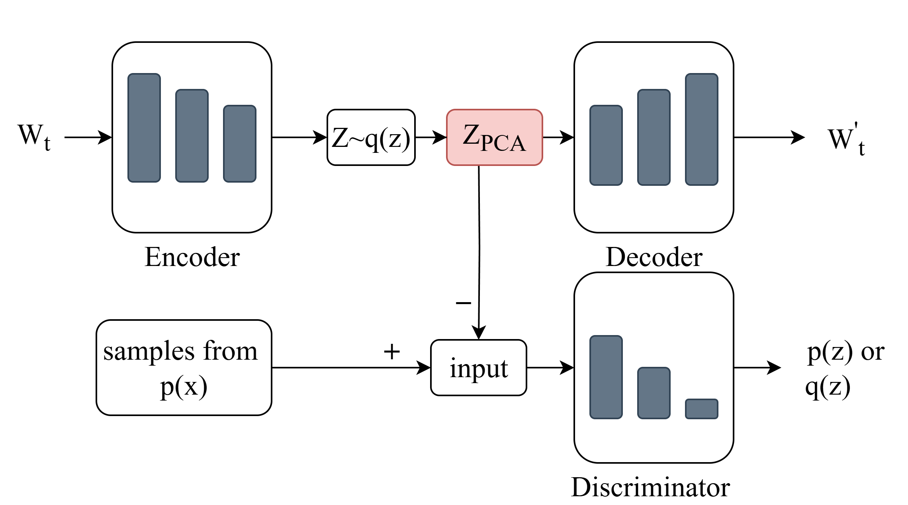

# Deep Learning-Based Anomaly Detection using PCA and Adversarial Autoencoder

A deep learning framework for multivariate time-series anomaly detection that integrates **Principal Component Analysis (PCA)** with an **Adversarial Autoencoder (AAE)** to improve detection performance while reducing computational cost.

This project was developed as part of my master's research and evaluated on two benchmark industrial and space telemetry dataset.

---

## Features

- Deep Learning-based anomaly detection
- Adversarial Autoencoder (AAE)
- Principal Component Analysis (PCA)
- GPU-accelerated model training using PyTorch
- Sliding window preprocessing
- Automatic threshold-based anomaly detection
- Evaluation on multiple benchmark datasets

---

## Datasets

This project was evaluated using the following publicly available datasets:

- SWaT
- SMAP

> **Note:** The datasets are **not included** in this repository due to their respective licensing and usage restrictions. Please obtain them from their official sources before running the notebook.

---

## Technologies

- Python
- PyTorch
- NumPy
- Pandas
- Scikit-learn
- Matplotlib
- Google Colab
- GPU (CUDA)

---

## Project Structure

```
AAE-PCA-Anomaly-Detection
│
├── notebook/
│   └── PCA_AAE_Anomaly_Detection.ipynb
│
├── figures/
│   ├── architecture.png
│   ├── hyperparameter.png
│   └── results_comparison.png
│
├── README.md
├── requirements.txt
└── LICENSE
```

---

## Model Architecture

<p align="center">

</p>

---

## Results

The proposed framework was evaluated using multiple benchmark datasets and demonstrated strong anomaly detection performance while improving computational efficiency.

Example result figures are available in the **figures/** directory.

---

## Installation

Clone the repository

```bash
git clone https://github.com/YOUR_USERNAME/Deep_Learning_Anomaly_Detection_PCA_AAE.git
```

Install the required packages

```bash
pip install -r requirements.txt
```

---

## Running the Project

Open the notebook located in

```
notebook/PCA_AAE_Anomaly_Detection.ipynb
```

Update the dataset path before execution.

---

## Repository Contents

- Complete implementation of the proposed model
- Training pipeline
- Evaluation pipeline
- Visualization of experimental results

---

## Citation

If you use this work in your research, please cite the corresponding publication (https://doi.org/10.3390/electronics14153141).

---

## Author

**Alaa Ali**
